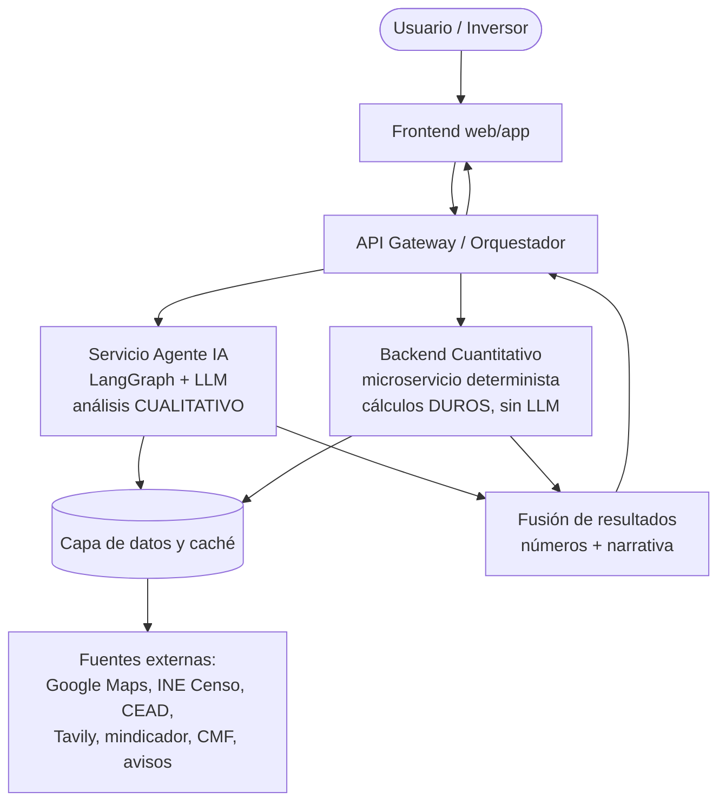
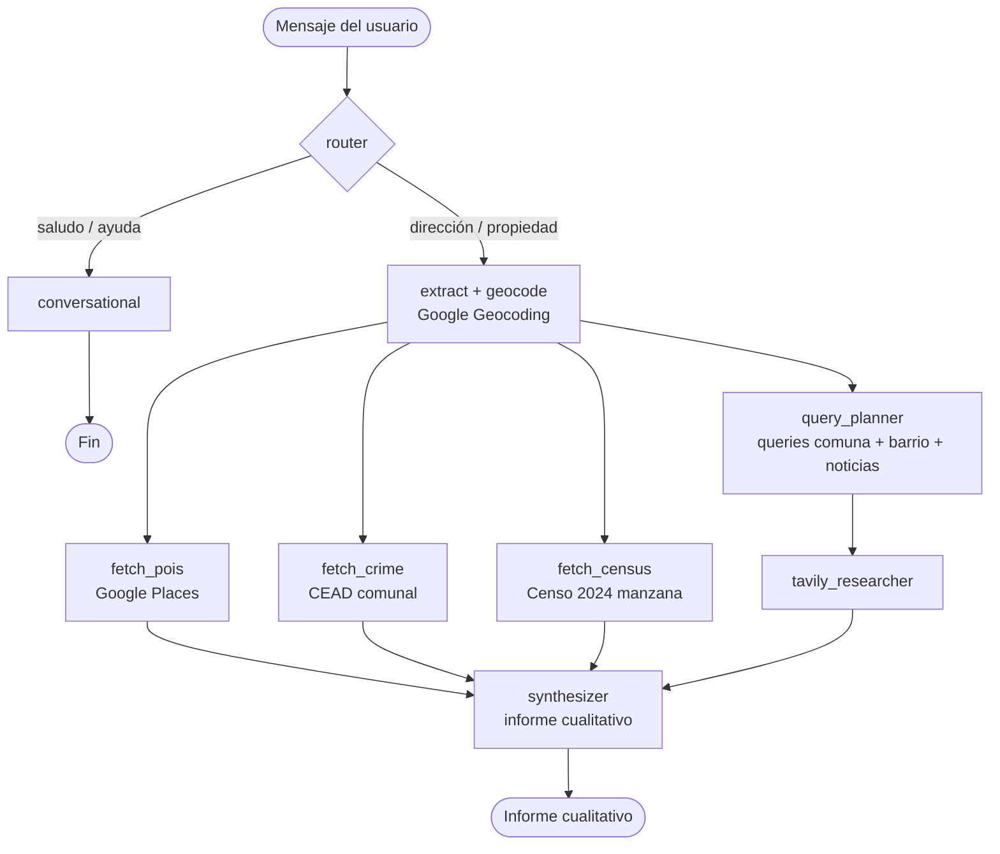
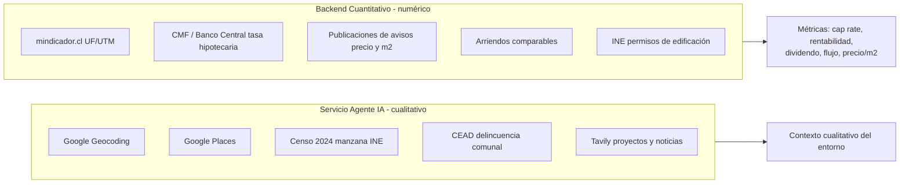
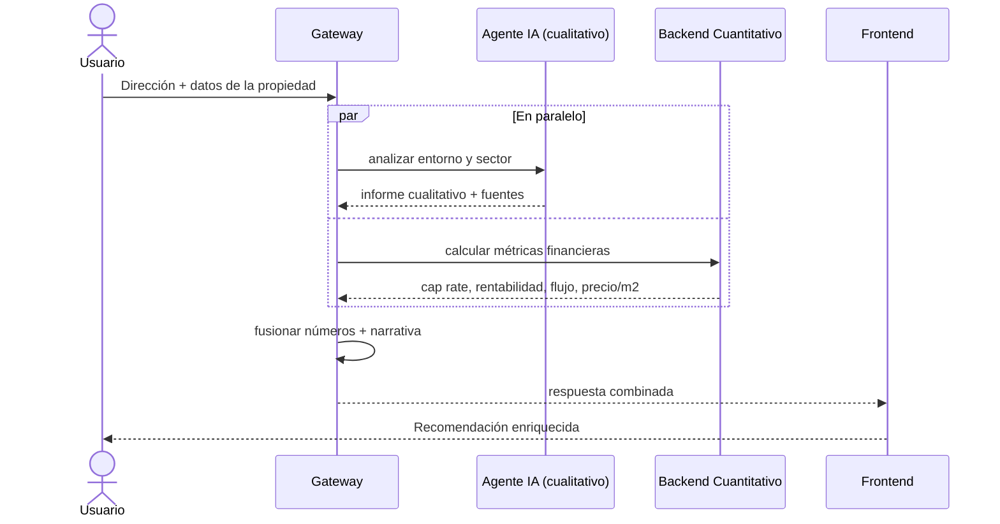
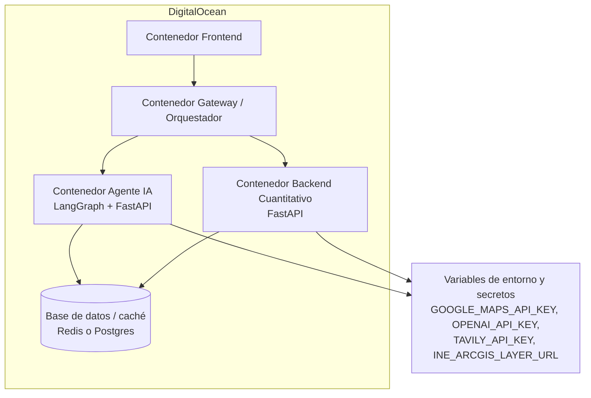

# Arquitectura deseada — Plataforma de recomendación de inversión inmobiliaria

Documento de visión técnica para presentar a la empresa. Describe la **arquitectura objetivo**
(no la del POC actual), donde **los datos duros los calcula un backend cuantitativo separado**
del agente de IA. El agente aporta el análisis **cualitativo** (entorno, sector, contexto) y el
backend aporta los **números** (cap rate, rentabilidad, flujo, precio/m²). La respuesta final al
usuario fusiona ambos.

Principio rector: **el LLM no calcula números y el backend no redacta narrativa.** Cada uno hace
lo que hace bien, y son servicios desplegables y escalables por separado.

---

## 1. Vista de sistema

Responsabilidades:
- **Servicio Agente IA**: entiende la consulta, geocodifica, recolecta contexto del entorno y del
  sector, y redacta el informe cualitativo. Es el foco de esta tesis/POC.
- **Backend Cuantitativo**: recibe los datos de la propiedad (precio, m², arriendo estimado) y
  calcula las métricas financieras de forma determinista y auditable. Sin LLM.
- **Orquestador**: llama a ambos en paralelo y fusiona la respuesta.
- **Caché**: evita repetir llamadas costosas (geocoding, places, censo) y normaliza cuotas/costos.

---

## 2. Flujo final del agente (LangGraph)

Dos niveles territoriales se mantienen separados en el informe: **sector** (manzana/barrio: censo
+ noticias) y **comuna** (delincuencia oficial CEAD).

---

## 3. Mapa de fuentes de datos y qué servicio las consume

Regla de diseño: una fuente vive en el servicio que la necesita. Las APIs de **lugares y contexto**
alimentan al agente; las de **dinero y mercado** alimentan al backend cuantitativo.

---

## 4. Secuencia de una consulta

El paralelismo importa: la recomendación final no espera secuencialmente; ambos servicios trabajan
a la vez y el gateway fusiona.

---

## 5. Vista de despliegue (DigitalOcean)

Notas de despliegue:
- Cada servicio es un contenedor independiente: se escala y actualiza por separado.
- El **LLM en producción** es OpenAI GPT (`LLM_PROVIDER=openai`); en desarrollo, Groq gratis.
- Las **API keys** viven en variables de entorno de la plataforma, nunca en el repositorio.
- La **caché** reduce costo de Google Places / geocoding / censo y suaviza límites de cuota.

---

## Resumen para la empresa

- **Separación clara**: IA para lo cualitativo, backend determinista para lo cuantitativo. Más
  fácil de auditar, testear y escalar; los números no dependen de un modelo de lenguaje.
- **Fuentes oficiales y trazables**: Google, INE Censo, CEAD, CMF/Banco Central, con citación.
- **Portabilidad de modelo**: cambiar de Groq a GPT (o a otro proveedor) es una variable de entorno.
- **Manejo responsable del sesgo**: la delincuencia se trata con dato oficial, framing neutral y
  disclaimers; las noticias de sector son contexto complementario, no veredicto.

---

## Detalle de datos analizados y sus fuentes

| Qué analizamos | De dónde lo sacamos (API / web) | Nodo |
|---|---|---|
| Ubicación (lat/lon, comuna, barrio, región) | Google Geocoding API v4 (`geocode.googleapis.com/v4`) | `extract` |
| Colegios cercanos (conteo + distancia) | Google Places API (New) searchNearby | `fetch_pois` |
| Locomoción (paradas, metro, tren) | Google Places API (New) | `fetch_pois` |
| Abastecimiento (supermercados) | Google Places API (New) | `fetch_pois` |
| Áreas verdes (parques) | Google Places API (New) | `fetch_pois` |
| Salud (hospitales, farmacias) | Google Places API (New) | `fetch_pois` |
| Delincuencia comunal (tasa/100k + comparación) | CEAD (Excel oficial → CSV manual, `app/data/`) | `fetch_crime` |
| Perfil socioeconómico del sector (manzana: población, viviendas, escolaridad) | INE Censo 2024 vía ArcGIS (`sig.ine.cl`) | `fetch_census` |
| Proyectos / plan regulador / permisos | Tavily (búsqueda web) | `query_planner` → `tavily_researcher` |
| Noticias del barrio/sector | Tavily | `query_planner` → `tavily_researcher` |
| Razonamiento del agente (clasificar, extraer, planificar, redactar) | Groq (local) / OpenAI GPT (prod) | `router`, `extract`, `query_planner`, `synthesizer` |
| UF / indicadores (bonus cuantitativo) | mindicador.cl | `apis/05` |
