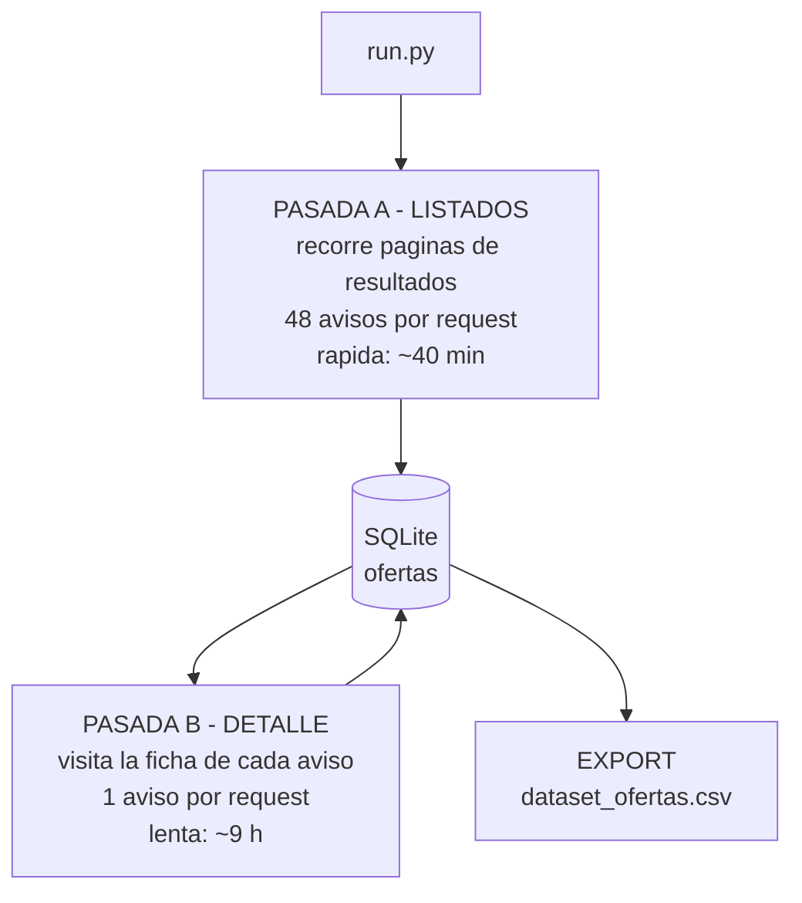

# Scraper de PortalInmobiliario — Documentación del proceso

Rama `scrapping_PI_v0`. Contiene **únicamente** el proceso de extracción de avisos
inmobiliarios desde PortalInmobiliario y la data generada. El código del agente de IA
(LangGraph) vive en la rama `main`.

**Objetivo:** construir un dataset propio de ofertas de venta y arriendo de viviendas en
**Macul, La Florida, Ñuñoa y San Miguel**, con la mayor cantidad de atributos posible, para
entrenar el modelo de Machine Learning de valoración/scoring de propiedades.

---

## 1. Contenido de la rama

```
scraper/
  config.py             comunas, operaciones, tipos, rate-limit, rutas
  schema.py             las 30 columnas del dataset
  normalize.py          precios UF/CLP, parseo numérico chileno
  storage.py            SQLite (upsert, cola de pendientes) + export CSV
  portalinmobiliario.py descarga y parseo de listados y fichas
  run.py                CLI: orquesta las pasadas
data/
  ofertas.sqlite        base de datos (fuente de verdad)
  dataset_ofertas.csv   export para pandas/Excel
  scrape_*.log          logs de las corridas
resumen_dataset.py      reporte del dataset (Ctrl+F5 en VS Code)
requirements.txt        httpx, beautifulsoup4, lxml
```

---

## 2. Herramientas usadas

| Herramienta | Tipo | Rol |
|---|---|---|
| **httpx** | externa | Cliente HTTP: descarga el HTML. Sesión persistente (reutiliza la conexión), timeouts, reintentos |
| **BeautifulSoup4 + lxml** | externa | Convierte el HTML en un árbol navegable; extracción con selectores CSS |
| **re** (regex) | estándar | ID del aviso, coordenadas lat/lon, "Publicado hace N días" |
| **sqlite3** | estándar | Base de datos real embebida: upsert, deduplicación, cola de trabajo |
| **csv** | estándar | Export final del dataset |
| **argparse** | estándar | Interfaz de línea de comandos |
| **time + random** | estándar | Rate limiting (pausas aleatorias entre requests) |
| **mindicador.cl** | API externa | Valor de la UF del día para normalizar precios |

No se usa navegador automatizado (Selenium/Playwright): PortalInmobiliario entrega el HTML ya
renderizado desde el servidor, así que basta descargar y parsear.

---

## 3. Arquitectura: dos pasadas



**¿Por qué separarlas?** El listado entrega 48 avisos por petición (barato); la ficha entrega 1
(caro). Separarlas permite tener el dataset básico en minutos y enriquecerlo después, pudiendo
interrumpir y reanudar sin perder trabajo.

---

## 4. El proceso paso a paso

### Paso 0 — Arranque (`run.py`)
`argparse` lee los flags y genera los **combos** a recorrer: 4 comunas × 2 operaciones
(venta/arriendo) × 2 tipos (casa/departamento) = **16 búsquedas**.

### Paso 1 — Conexión a la base (`storage.py`)
Se abre `data/ofertas.sqlite`. Si la tabla no existe se crea con **clave primaria compuesta
`(sitio, id_aviso)`** — la base de la deduplicación. Además corre una **migración automática**:
compara las columnas existentes contra el esquema y agrega las que falten con `ALTER TABLE`.

### Paso 2 — Pasada A: listados

**2a. URL con paginación.** Patrón del portal:
```
https://www.portalinmobiliario.com/{operacion}/{tipo}/{comuna}-metropolitana
...y las páginas siguientes con sufijo _Desde_49, _Desde_97, ... (de 48 en 48)
```

**2b. Descarga (httpx).** GET con headers de navegador real (`User-Agent`, `Accept-Language`).
Ante HTTP 403/429 espera 5/10/15 s y reintenta (hasta 3 veces); ante error de red, 2/4 s.

**2c. Parseo (BeautifulSoup + lxml).** Se seleccionan las tarjetas con `li.ui-search-layout__item`
y de cada una se extrae:
- link → con regex se obtiene el ID (`MLC-3585368896` → `3585368896`)
- título, precio (`andes-money-amount`), atributos (`poly-attributes` → dormitorios, baños, m²),
  ubicación (`poly-component__location`)
- las tarjetas sin link `MLC` son publicidad → se descartan

**2d. Normalización (`normalize.py`).** Números en formato chileno (`"5.500"` → `5500.0`) y
precio a **ambas monedas** usando la UF del día de mindicador.cl (consultada una sola vez por
ejecución gracias a `lru_cache`).

**2e. Guardado — el upsert.**
```sql
INSERT ... ON CONFLICT(sitio, id_aviso) DO UPDATE SET <solo campos de listado>
```
Si el aviso es nuevo se inserta; si existía, se **refrescan sus campos de tarjeta** sin tocar los
de detalle ni el flag `detalle_ok`. Esto garantiza **cero duplicados** y que **re-ejecutar sea
seguro** (de hecho, re-correr el listado repara datos y captura avisos nuevos).

**2f. Cortesía.** `sleep(random.uniform(1.5, 2.5))` entre requests. La paginación termina cuando
una página llega sin tarjetas o al tope del portal (2.016 resultados por búsqueda).

### Paso 3 — Pasada B: fichas de detalle

**3a. Cola de pendientes.** `SELECT ... WHERE detalle_ok = 0` — la base *es* la cola de trabajo,
por eso reanudar es gratis.

**3b. Extracción por ficha:**
- **Tabla de especificaciones** (`andes-table`): superficie total/útil, dormitorios, baños,
  estacionamientos, bodegas, antigüedad, gastos comunes. Regla: **solo se escribe si el valor
  parsea a número**, nunca se pisa un dato bueno con vacío.
- **Antigüedad → año de construcción**: "75 años" → `2026 − 75 = 1951`.
- **Fecha de publicación** (regex): "Publicado hace 18 días" → `hoy − 18 días`.
- **Coordenadas** (regex sobre la URL del mapa embebido): `center=-33.46,-70.59` → lat, lon.
- **Descripción**: texto largo del aviso (truncado a 2.000 caracteres).

**3c. Guardado.** `UPDATE ... SET <campos>, detalle_ok = 1`, con **commit cada 25 fichas**: si el
proceso muere, se pierde como máximo ~1 minuto de trabajo.

### Paso 4 — Export
`SELECT` completo → `data/dataset_ofertas.csv` en UTF-8 con BOM (para que Excel muestre las
tildes correctamente).

---

## 5. Las 30 columnas del dataset

| Grupo | Columnas |
|---|---|
| Identificación | `sitio`, `id_aviso`, `url`, `titulo`, `fecha_scrape` |
| Clasificación | `operacion` (venta/arriendo), `tipo` (casa/departamento) |
| Ubicación | `comuna`, `barrio`, `direccion`, `lat`, `lon` |
| Precio | `precio_valor`, `precio_moneda`, `precio_clp`, `precio_uf` |
| Superficie | `m2_util`, `m2_total` |
| Características | `dormitorios`, `banos`, `estacionamientos`, `bodegas` |
| Antigüedad | `antiguedad_anos`, `ano_construccion` |
| Costos | `gastos_comunes_clp` |
| Aviso | `antiguedad_aviso_dias`, `fecha_publicacion`, `publica`, `descripcion` |
| Control | `detalle_ok` (1 = ficha visitada) |

`lat`/`lon` son especialmente valiosas: permiten enriquecer cada aviso con variables de entorno
(colegios, metro, áreas verdes, seguridad) para el modelo.

---

## 6. Cómo ejecutarlo

```bash
# instalar dependencias
pip install -r requirements.txt

# todo el proceso (listados + fichas pendientes) — modo normal de mantenimiento
python -m scraper.run --sitio pi

# solo listados (rápido: refresca precios y captura avisos nuevos)
python -m scraper.run --sitio pi --solo-listado

# solo fichas de detalle pendientes
python -m scraper.run --sitio pi --solo-detalle

# prueba acotada
python -m scraper.run --sitio pi --comuna nunoa --operacion venta --tipo casa --max-paginas 1

# solo exportar CSV y ver conteos
python -m scraper.run --export
```

Ver el estado del dataset en cualquier momento (funciona incluso mientras el scraper corre):
```bash
python resumen_dataset.py
```

**Reanudación:** el proceso puede interrumpirse con Ctrl+C y relanzarse; la pasada de detalle
retoma desde la cola de pendientes. La pasada de listados siempre recorre las búsquedas completas
(es un refresco, no tiene punto de retorno), pero al ser idempotente no genera duplicados.

---

## 7. Diseño: las 4 ideas que sostienen el proceso

1. **La base de datos es la cola de trabajo** (`detalle_ok`): el estado vive en disco, no en
   memoria → el proceso es interrumpible por diseño.
2. **Idempotencia** (clave primaria + upsert): correr dos veces nunca duplica; re-correr repara.
3. **Separar lo barato de lo caro** (listado vs detalle): lo masivo primero, lo lento después
   y reanudable.
4. **Nunca degradar datos**: un valor nuevo solo reemplaza al anterior si es un dato real.

---

## 8. Consideraciones sobre los datos

- Es una **fotografía del stock de avisos vigentes** a la fecha de captura (`fecha_scrape`), sin
  filtros de contenido: se recolecta todo y se filtra en la etapa de limpieza.
- Los precios son de **publicación, no de cierre** (suelen estar por sobre el precio final de
  venta). Es un sesgo conocido a documentar en el análisis del modelo.
- Deduplicado por ID de aviso. Puede existir la **misma propiedad publicada por dos corredoras**
  con IDs distintos → se detecta en la limpieza comparando dirección, m² y precio.
- Los **"proyectos"** (edificios nuevos) agrupan varias unidades en un aviso, con precio "desde"
  y rangos de m².
- Las búsquedas con más de **2.016 resultados quedan truncadas** en ese tope (límite de
  paginación del portal). Afecta a departamentos en venta de Ñuñoa y San Miguel.
- `robots.txt` de PortalInmobiliario fue revisado: las rutas de búsqueda utilizadas están
  permitidas. Se usa rate limiting conservador. Uso académico/POC.
