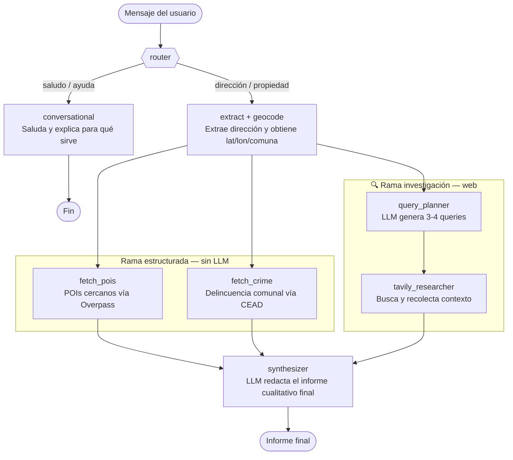
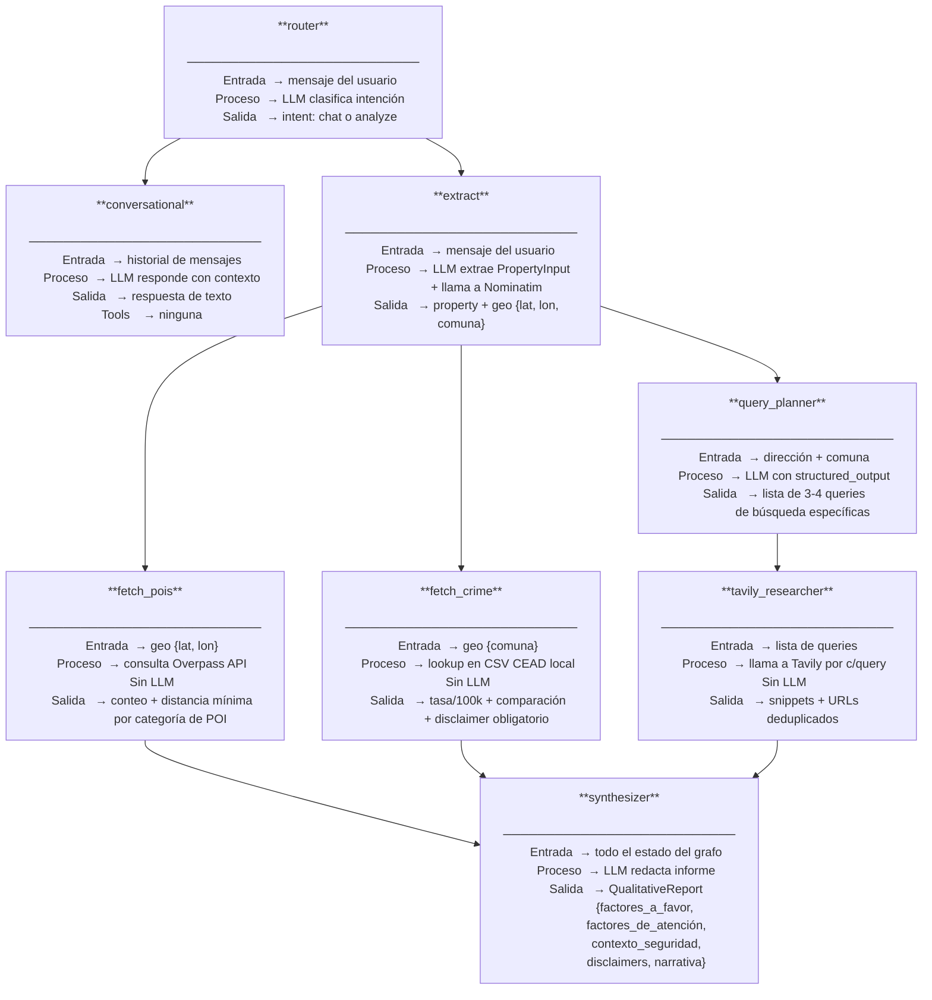
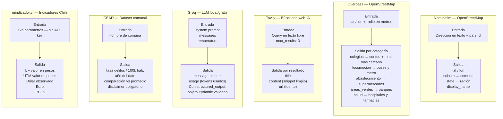
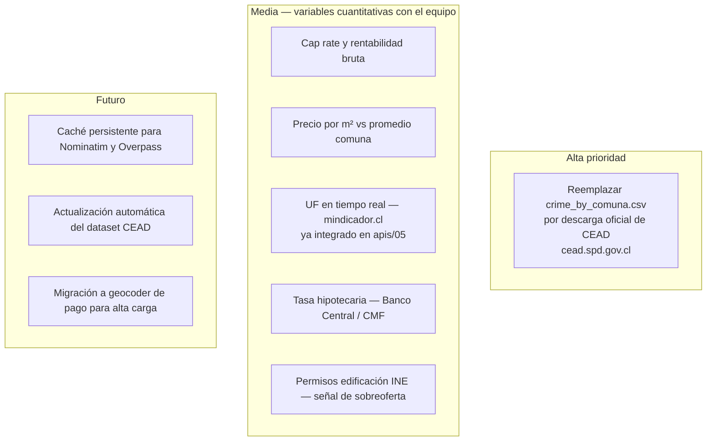

# Documentación POC — Agentes de Recomendación Inmobiliaria

Sistema de agentes con **LangGraph** que enriquece el análisis de una oferta inmobiliaria
con información cualitativa del entorno. LLM: **Groq gratis** en local → **OpenAI GPT**
en producción (DigitalOcean), cambiable con una variable de entorno.

---

## 1. Flujo principal del grafo

---

## 2. Detalle de cada nodo

---

## 3. APIs y herramientas — qué se envía y qué devuelven

---

## 7. Pendientes

